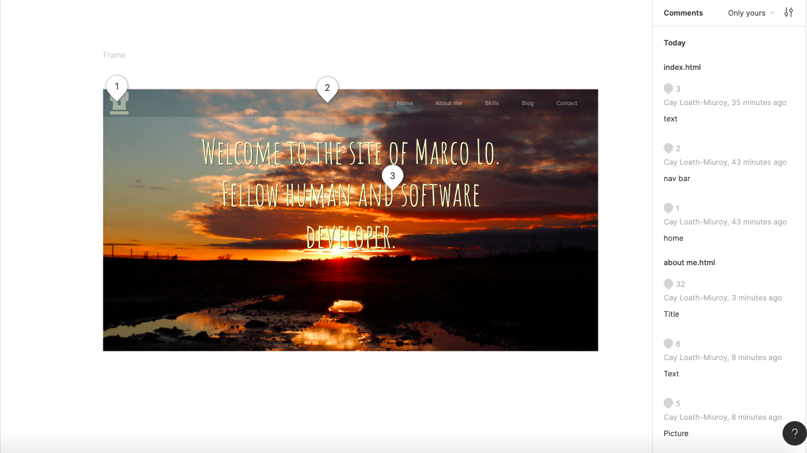
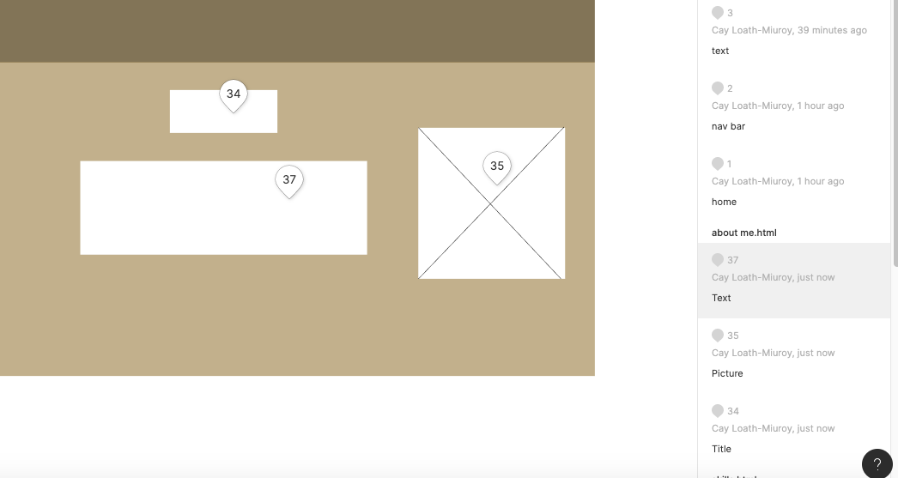
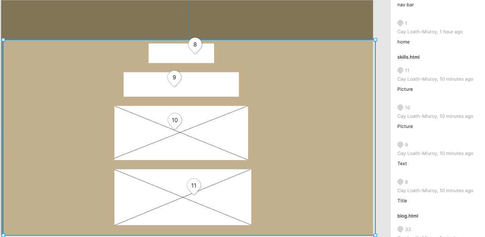
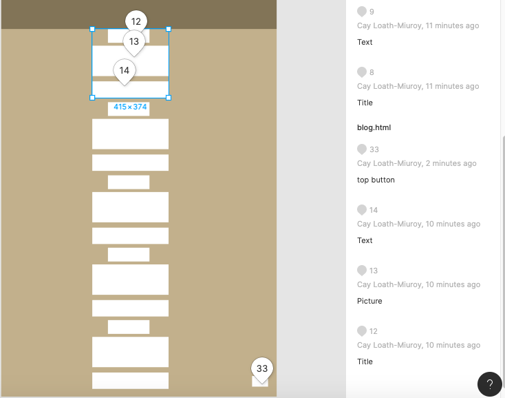
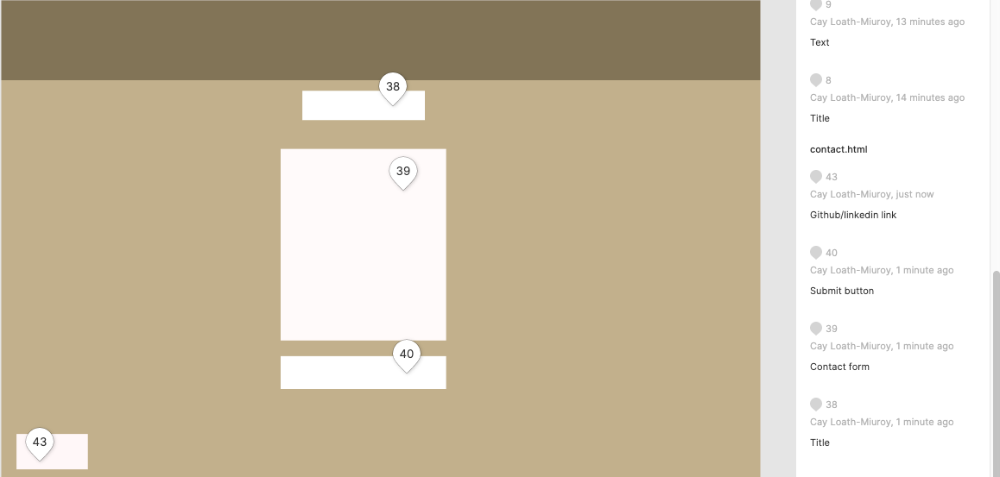
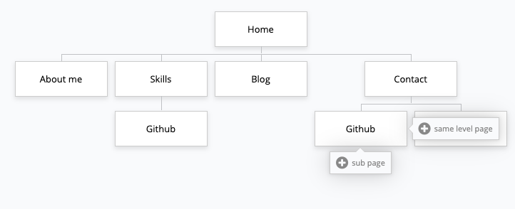
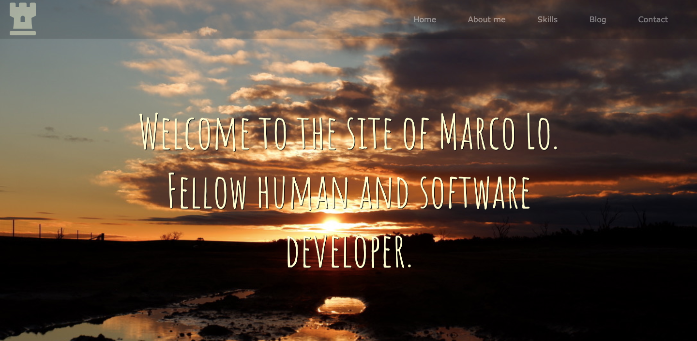
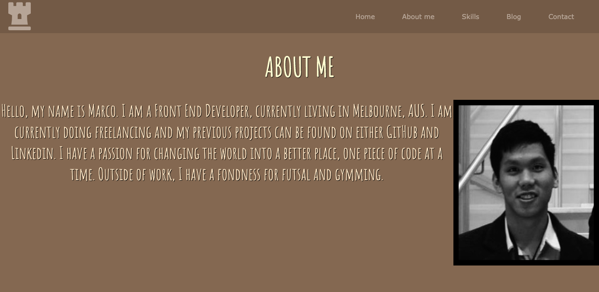
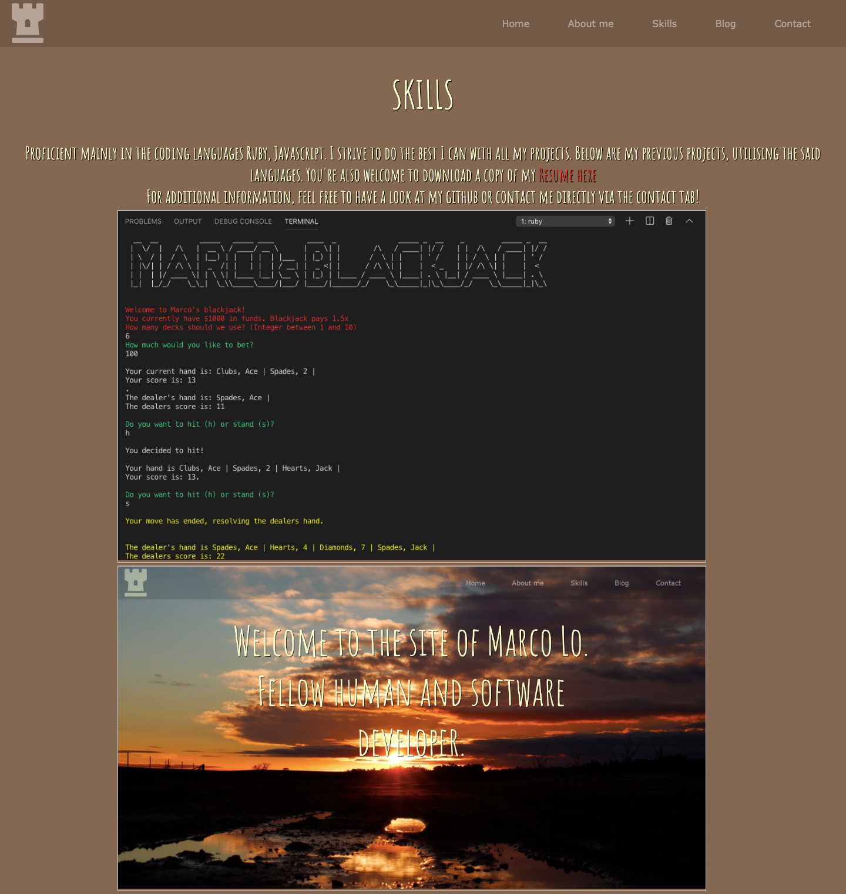
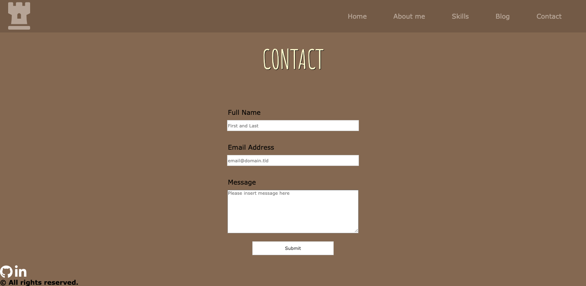

**Marco Lo's Portfolio**
Link: https://marcolotr.netlify.com/index.html
GitHub Repository: https://github.com/Marcohylo

**Purpose:** The purpose of this portfolio project was to showcase my html and css capabilities and what I could achieve in the mere week I was given to learn these two core technologies used in creating web pages.

**Features:**
Upon arrival at the landing page you will be met with a navigational bar which can take the website viewer to "Home", "About me", "Skills", "Blog" and "Contact". Below are attached images that showcase all the different features per page, using Figma. 

**Sitemap**
A sitemap was also created for easier accessibility of the website.
 

**Screenshots**

**Target audience:**
The target audience of this website portfolio was to showcase my personality and skillsets to potential future partners or employers in the vast world that is the programming community. 

**Tech Stack:**
1.html
2.css
3.Netlify
4.Formspree
5.Figma
6.GitHub
